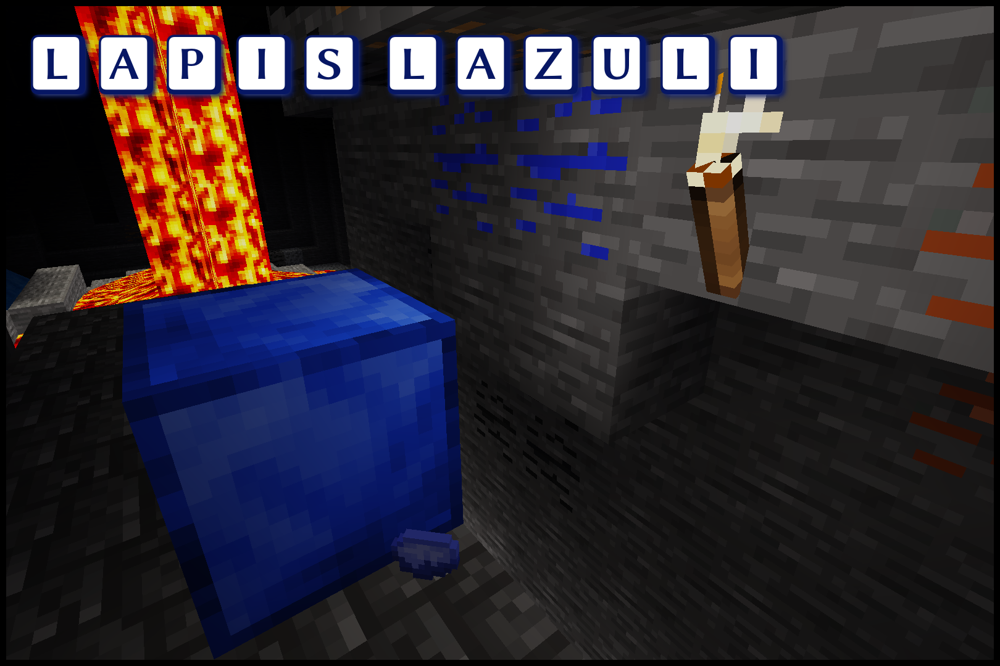

# Minetest Mod Lapis Lazuli
Version 1.2, License: WTFPL/CC BY-SA 3.0; See LICENSE.txt

## Description
This mod adds lapis lazuli ore, items and blocks. The only use of it is to craft dye with it or build something blue like a swimming pool.

## Notes
The mod should be playable with Minetest 0.4.8 or above. There are two dependencies from MTG or similar: "default" and "dye".

## Bug reports and suggestions
You can report bugs or suggest ideas on [GitHub](https://github.com/minetest-mods/lapis/issues/new), in the [Minetest Forum](http://forum.luanti.org/viewtopic.php?t=11287) or just [email](mailto:git@lnj.li) me.

## Links
* [GitHub](https://github.com/minetest-mods/lapis)
* [Luanti Forum](http://forum.luanti.org/viewtopic.php?t=11287)

